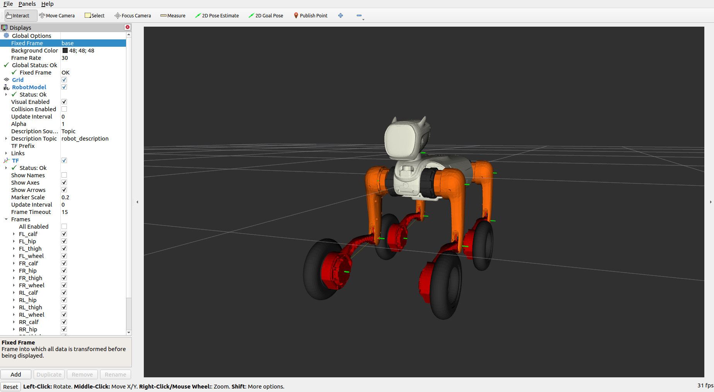

# magicdog-w Description (URDF & MJCF)

## Overview

This package includes a universal humanoid robot description (URDF & MJCF) for the [Magicdog-W](https://www.magiclab.top/dog-w), developed by Magiclab Robotics.

<table>
  <tr>
    <td></td>
    <td></td>
  </tr>
</table>

Magicdog-W have 16 joints:

```text
root [⚓] => /base/
    FL_hip_joint [⚙+X] => /FL_hip/
        FL_thigh_joint [⚙+Y] => /FL_thigh/
            FL_calf_joint [⚙+Y] => /FL_calf/
                FL_wheel_joint [⚙+Y] => /FL_wheel/
    FR_hip_joint [⚙+X] => /FR_hip/
        FR_thigh_joint [⚙+Y] => /FR_thigh/
            FR_calf_joint [⚙+Y] => /FR_calf/
                FR_wheel_joint [⚙+Y] => /FR_wheel/
    RL_hip_joint [⚙+X] => /RL_hip/
        RL_thigh_joint [⚙+Y] => /RL_thigh/
            RL_calf_joint [⚙+Y] => /RL_calf/
                RL_wheel_joint [⚙+Y] => /RL_wheel/
    RR_hip_joint [⚙+X] => /RR_hip/
        RR_thigh_joint [⚙+Y] => /RR_thigh/
            RR_calf_joint [⚙+Y] => /RR_calf/
                RR_wheel_joint [⚙+Y] => /RR_wheel/
```
## Usages

### RViz
```bash
sudo apt install ros-humble-joint-state-publisher-gui
cd magicdog-w_description
colcon build
source install/setup.bash
ros2 launch magicdog-w_description view.launch.py 
```

### MuJoCo
```bash
pip install mujoco
cd magicdog-w_description
python3 -m mujoco.viewer --mjcf=mjcf/MAGICDOGW.xml
```
